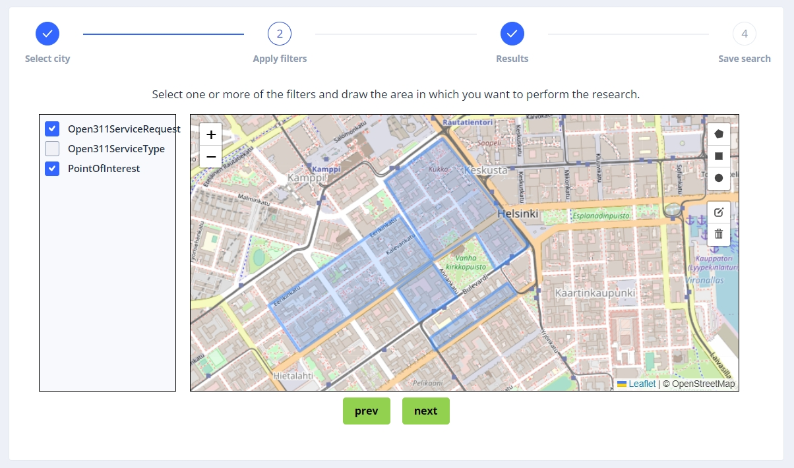

# GeoCacher – Usage instructions

## Introduction

GeoCacher is an online application designed for the research of specific point of interests in certain regions of Europe. 

## User Interface

    1. List of projects
    2. Name of the project
    3. Selected region
    4. Project description
    5. Selected Filters
    6. Create New Project
    7. View or Delete current project

# Creating a new Project

## Step 1 – Select Region

To create a new project click on the “Create New Project” button (Figure 1, 6), in the home page of the application, and you will then be redirected to a page containing the following component:

## Step 2 – Apply filters and determine area

Once in this interface, select the area you want to research on, then wait for the next page to load (this might take a few seconds). When the loading is completed, the following interface will be prompted:

In the left side of the screen, you will find a list of all the filters available for the research in the selected area. Select one or more filters, then use the tools on the right-top corner of the map to draw the area in which you want Urbanage to find the points matching your filters criteria
(example in Figure 4), then click on Next.

## Step 3 – Review the results of the research

The results of your research will now appear on the map inside the areas previously created, in the form of blue markers. Use the selectors in the top right corner of the map to show only one specific set of filters at a time.

Click on Next if you are happy with the result, or use Prev to return to step 2 and refine your research.

## Step 4 – Save project

Insert the name for your project and then add a description (optional), then click on Save.

# Editing a Project

To edit a project that you have already saved, select it from the list in the landing page (1) and click on View (7).
A map with the markers from all filters, already applied, will be prompt.

In the bottom left corner of the component, click on Edit then refer to the same instructions for Creating a project, starting from step2. In this case, the areas previously drawn on the map will now be loaded by default. You can now edit them or delete them entirely and start anew.

NOTE: It is not possible to modify the region of the project. If you want to change the region of you research, we suggest to create a new project.

# Delete project

To delete a project, find it in the list from the landing page (1) and click on the corresponding Delete button.

# Other functionality

- Publication on the IDRA portal
- Automatic updates of layers saved in a given time interval
