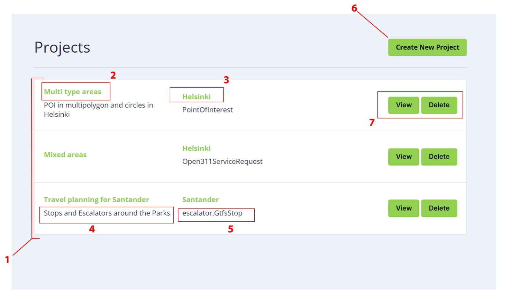
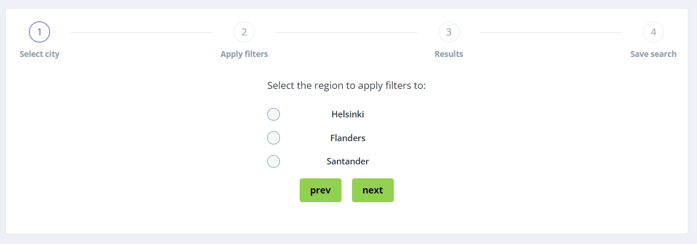
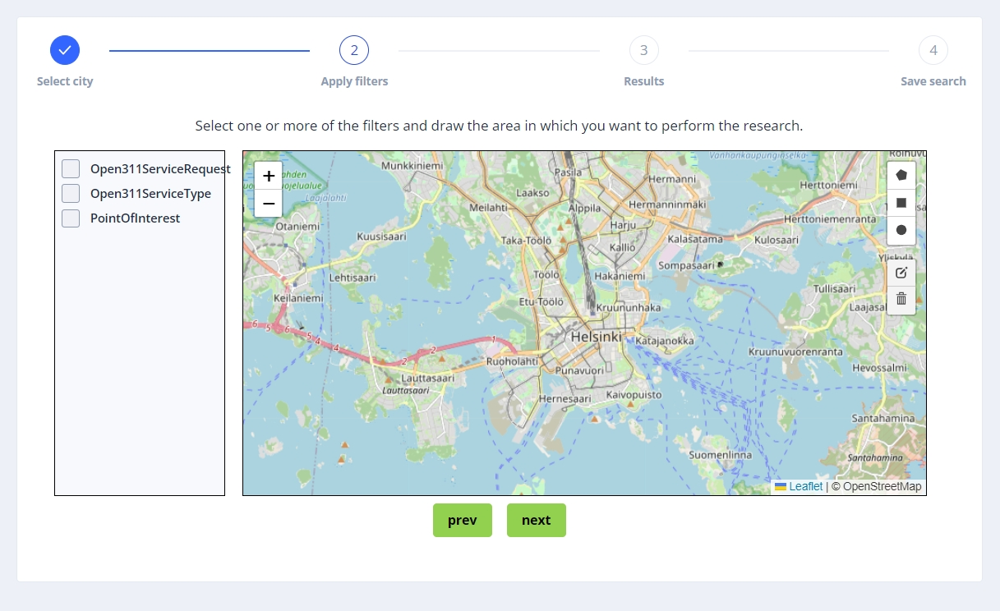
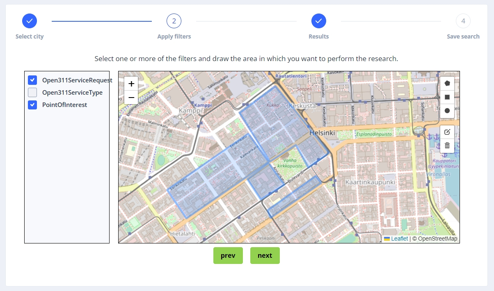
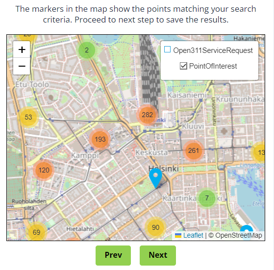
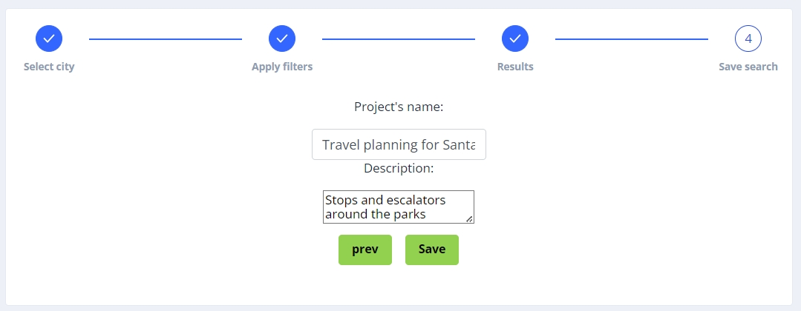
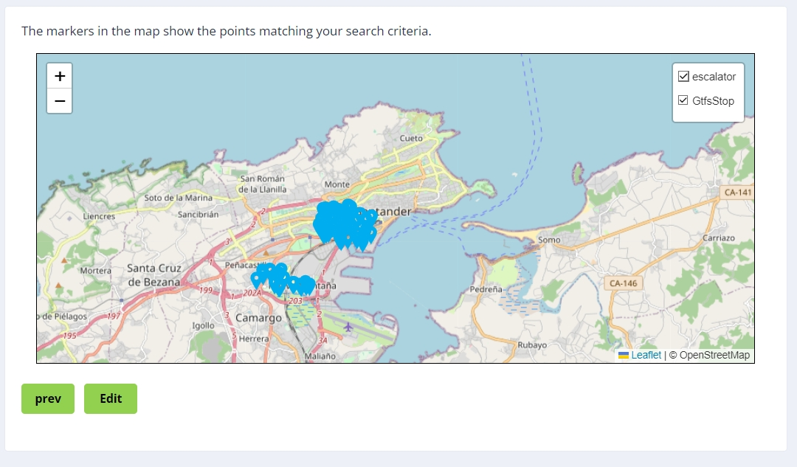
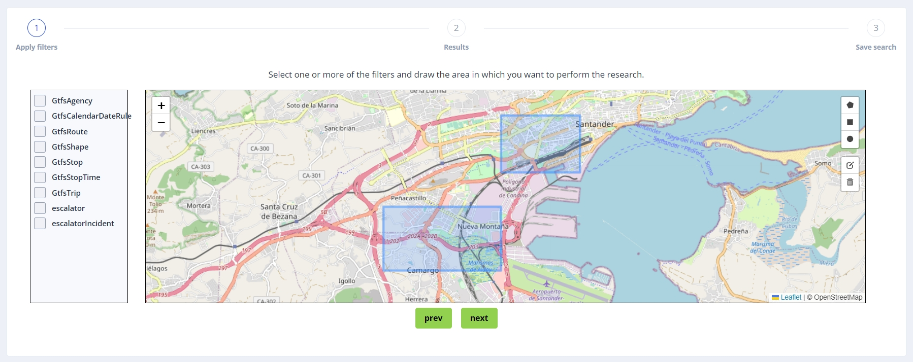

# GeoCacher

## Summary

- [Description](#description)
- [Images](#images)
- [Installation Prerequisites](#installation-prerequisites)
- [Installation Instructions](#installation-instructions)
- [Built Image Registry](#built-image-registry)
- [License](#license)
- [External Technical Resources](#external-technical-resources)
- [User Guide](#user-guide)

---

## Description
GeoCacher is an online application designed for the research of specific points of interest within selected regions of Europe.

---

## Images
Below are screenshots illustrating GeoCacher’s interface and key workflows:

  
  
  
  
  
  
  

---

## Installation Prerequisites

- A modern web browser (Chrome, Firefox, Edge, or Safari) with JavaScript enabled  
- Internet connection  
- A valid GeoCacher user account for accessing project data  

---

## Installation Instructions

GeoCacher is delivered as a hosted web application. To access it:

1. Navigate to the GeoCacher URL provided by your organization.  
2. Log in with your credentials.  
3. You will be directed to the landing page displaying existing projects.

---

## Built Image Registry

_Not applicable – GeoCacher is delivered as a hosted web service._

---

## License

_Coming soon._

---

## External Technical Resources

_Coming soon._

---

## User Guide

### Table of Contents
1. [Getting Started](#getting-started)  
2. [User Interface](#user-interface)  
3. [Creating a New Project](#creating-a-new-project)  
4. [Editing a Project](#editing-a-project)  
5. [Deleting a Project](#deleting-a-project)  
6. [Other Functionality](#other-functionality)  

### 1. Getting Started
Upon logging in, you will land on the main dashboard where you can view, create, and manage your GeoCacher projects.

### 2. User Interface

The landing page consists of the following components:
1. **List of Projects**: Displays all your saved projects.  
2. **Project Name**: The title of each project.  
3. **Selected Region**: The geographic region associated with the project.  
4. **Project Description**: Optional description provided at save.  
5. **Selected Filters**: Active filters applied in the project.  
6. **Create New Project**: Button to start a new research workflow.  
7. **View/Edit/Delete Project**: Options to open, modify, or remove an existing project.

### 3. Creating a New Project

#### Step 1 – Select Region
1. Click the **Create New Project** button on the landing page.
2. The system will display a map of Europe.
3. Use the zoom and pan controls to navigate to your desired location.
4. Select the region you wish to analyze from the available options.

  

#### Step 2 – Apply Filters and Determine Area
1. Once you've selected a region, you'll see a sidebar with available filters.
2. Check one or more filters from the categories presented to narrow down the points of interest.
3. Use the map drawing tools (rectangle, polygon, or circle) to define your precise search area.
4. You can draw multiple areas if needed and edit them by clicking on existing shapes.
5. Click **Next** to proceed when your filters and areas are defined.

  
  

#### Step 3 – Review Results
1. The system will process your request and display markers on the map representing points of interest that match your criteria.
2. Use the filter selector in the top-right corner to toggle visibility of specific datasets.
3. Click on individual markers to view detailed information about each point of interest.
4. If you're satisfied with the results, click **Next** to proceed to the final step.

  

#### Step 4 – Save Project
1. Enter a meaningful name for your project in the "Project Name" field.
2. (optional) Provide an  description that helps identify the purpose of this research.
3. (optional) Toggle the "Auto-update" function if you wish your project to automatically check for new results at regular intervals. A radio menu will appear allowing you to select from several time interval options (hourly, daily, weekly, etc.).
4. Click **Save** to store your configuration for future access and analysis.
5. After saving, you'll be redirected to the project view page where you can explore your results in detail.

  

### 4. Editing a Project
1. From the landing page, locate the project you wish to modify.
2. Click the **View** button to open the project.
3. In the project view, click the **Edit** button at the bottom-left of the map.
4. You can now modify filters or redraw/adjust areas as needed.
5. Click **Save** when your changes are complete.

> **Note:** It is not possible to modify the region once set; to research a new region, create a new project.

  
  

### 5. Deleting a Project
From the landing page, locate the project and click the corresponding **Delete** button to remove it permanently.

### 6. Other Functionality
- **Publication on the IDRA Portal**: Share your findings with a wider audience through the integrated IDRA Portal publishing feature.
- **Automatic Layer Updates**: Configure your projects to automatically refresh data at specified intervals, ensuring you always have the most current information.
